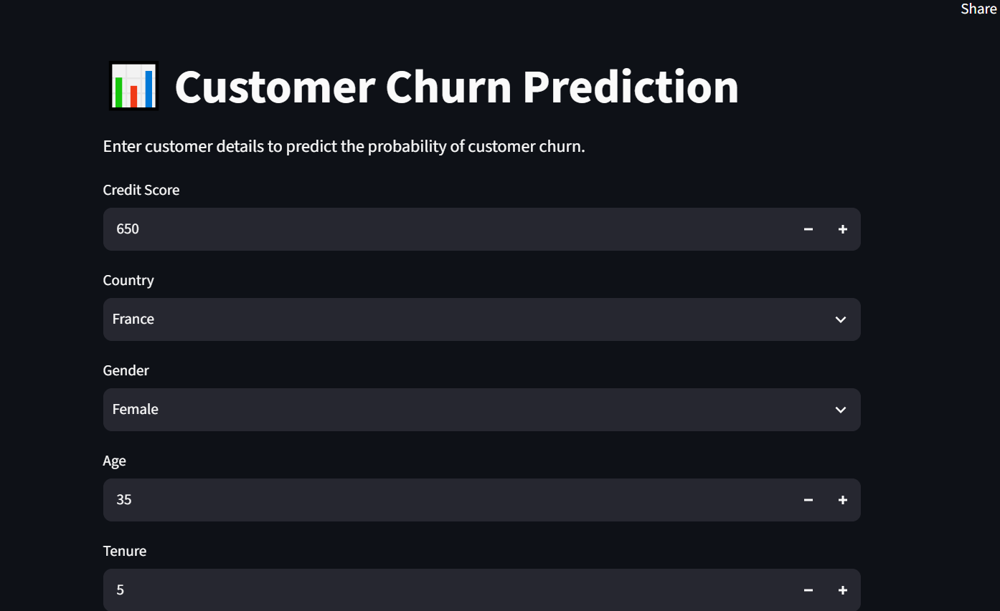
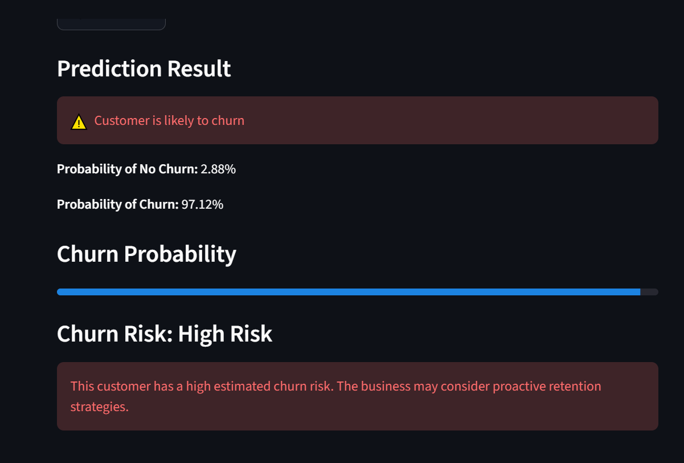
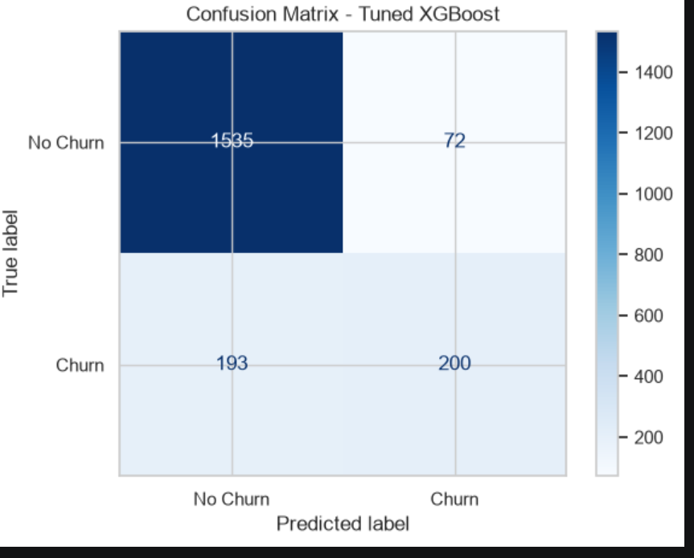
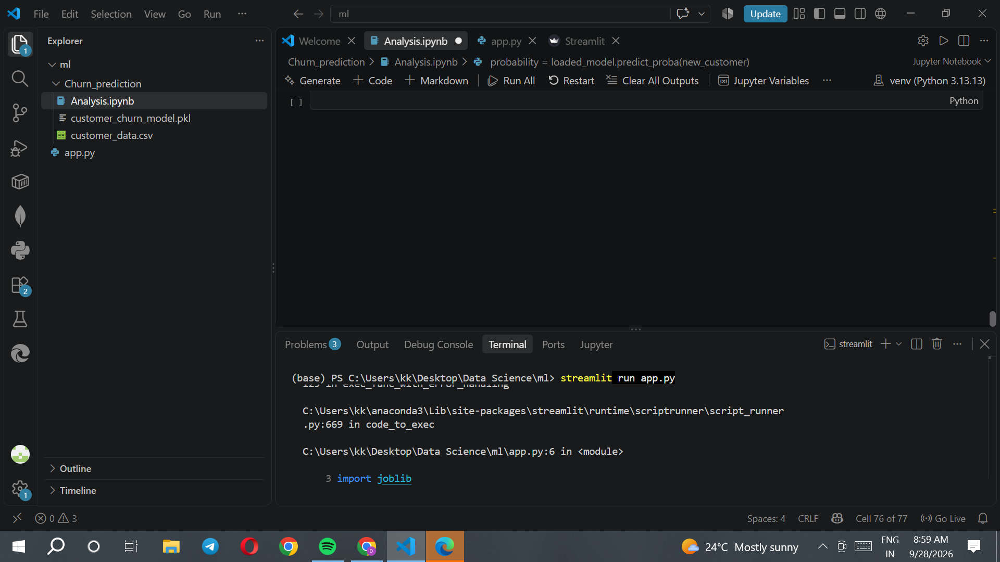

# Customer Churn Prediction

## 📌 Project Overview

Customer churn prediction is a machine learning project that predicts whether a customer is likely to leave a company.

In this project, customer information such as credit score, age, balance, number of products, activity status, and country is used to predict customer churn.

The project includes:
- Data analysis and preprocessing
- Categorical feature encoding
- Machine learning model training
- Model comparison
- Hyperparameter tuning
- Feature importance analysis
- Churn probability prediction
- Streamlit web application

---

## 🎯 Objective

The main objective of this project is to build a machine learning model that can identify customers who are more likely to churn.

This can help businesses:
- Identify potential churn customers
- Understand important churn-related signals
- Support customer retention strategies
- Make data-driven decisions

---

## 📊 Dataset

The dataset contains **10,000 customer records** and **12 columns**.

### Features

| Feature | Description |
|---|---|
| customer_id | Unique customer identifier |
| credit_score | Customer's credit score |
| country | Customer's country |
| gender | Customer's gender |
| age | Customer's age |
| tenure | Number of years with the company |
| balance | Customer's account balance |
| products_number | Number of products used |
| credit_card | Whether the customer has a credit card |
| active_member | Whether the customer is an active member |
| estimated_salary | Estimated customer salary |
| churn | Target variable |

The target variable is:

- `0` → No Churn
- `1` → Churn

---

## 🔍 Data Preprocessing

The following preprocessing steps were performed:

1. Checked for missing values
2. Checked for duplicate records
3. Removed `customer_id` because it is an identifier and not a useful predictive feature
4. Separated features and target
5. Split the dataset into training and testing sets
6. Applied One-Hot Encoding to categorical features

The categorical features were:

- `country`
- `gender`

After encoding, the feature count increased from **10 to 13**.

---

## 🤖 Machine Learning Models

The following classification algorithms were tested:

1. Logistic Regression
2. Decision Tree
3. Random Forest
4. XGBoost

### Model Comparison

| Model | Accuracy | Churn Precision | Churn Recall | Churn F1 |
|---|---:|---:|---:|---:|
| Logistic Regression | 81.10% | 55% | 20% | 29% |
| Decision Tree | 77.70% | 44% | 51% | 47% |
| Random Forest | 86.60% | 75% | 48% | 58% |
| XGBoost | 85.85% | 70% | 50% | 58% |

---

## ⚙️ Hyperparameter Tuning

GridSearchCV was used to tune the Random Forest and XGBoost models.

For XGBoost, parameters such as:

- `n_estimators`
- `max_depth`
- `learning_rate`
- `subsample`
- `colsample_bytree`

were tested.

The tuned XGBoost model achieved:

- **Accuracy:** 86.75%
- **Churn Precision:** 74%
- **Churn Recall:** 51%
- **Churn F1-score:** 60%
- **ROC-AUC:** 0.873

These results are based on the test split used in this project.

---

## 📈 Feature Importance

The tuned XGBoost model identified several features as important predictive signals.

The top features included:

1. Products Number
2. Active Member
3. Age
4. Country (Germany)
5. Gender (Female)
6. Balance

Feature importance indicates how useful a feature was for the trained model's predictions. It does not by itself prove that a feature causes churn.

---
## 🌐 Streamlit Application

A Streamlit web application was developed with the assistance of AI tools to provide an interactive interface for the trained churn prediction model.

The application allows users to enter customer information and receive:
- Churn prediction
- Estimated churn probability
- Estimated no-churn probability
- Churn risk level
- Business-oriented recommendation

### Risk Levels

| Churn Probability | Risk Level |
|---|---|
| Below 30% | Low Risk |
| 30%–59% | Medium Risk |
| 60% or above | High Risk |

These risk thresholds are business rules defined for the application and are not learned directly by the machine learning model.

---

## 🛠️ Technologies Used

- Python
- Pandas
- NumPy
- Scikit-learn
- XGBoost
- Joblib
- Streamlit
- Jupyter Notebook

---
## 📸 Application Screenshots

### Streamlit Application



### Customer Churn Prediction



### Confusion Matrix



### ROC Curve


## 🤖 AI-Assisted Development

AI tools were used as a development assistant while building the Streamlit application.

The AI assistance was mainly used for:
- Structuring the Streamlit interface
- Creating the customer input form
- Connecting the trained machine learning model with the application
- Displaying prediction probabilities and risk levels
- Debugging and resolving implementation issues

The machine learning workflow, data analysis, model training, evaluation, and interpretation were performed and understood as part of the project development.


## 📂 Project Structure

```text
Churn_prediction/
│
├── Analysis.ipynb
├── app.py
├── customer_data.csv
├── customer_churn_model.pkl
├── requirements.txt
└── README.md

```


## 🌐 Live Demo

Try the deployed Streamlit application:

[Customer Churn Prediction App](https://7g5mfate7gfbmthfyvipng.streamlit.app/#prediction-result)
## 👩‍💻 Author

**Divya Konnur**

Computer Science and Engineering Graduate  
Aspiring Data Analyst | Data Scientist

- GitHub: [Divyakonnur25](https://github.com/Divyakonnur25)
- LinkedIn: [Divya Konnur](https://www.linkedin.com/in/divya-konnur-4982a3345/)
